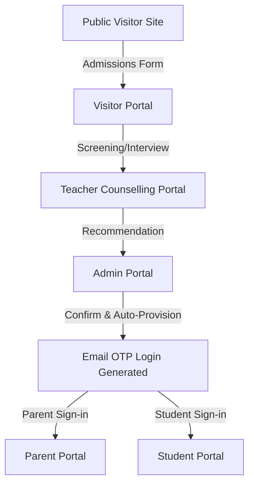

# 🎓 EduNova Global Academy — School ERP & CMS Platform

EduNova is a state-of-the-art, client-ready **School ERP & Content Management System (CMS)**. Built with high-fidelity, premium visual design paradigms (responsive layouts, customized Tailwind color charts, and micro-interactions), it acts as a cohesive academic platform serving visitors, students, parents, teachers, and administrators.

---

## 🌟 Visual Aesthetics & Design System
* **Modern Typography**: Powered by premium typography (Google Fonts - Inter/Outfit) rather than browser defaults.
* **Curated Color Palettes**: Academic Blue (`#1E3A8A`), Academic Gold (`#FBBF24`), and sleek slate interfaces.
* **Responsive Visuals**: Responsive views optimized for standard desktop viewports down to iOS/Android mobile screens.
* **Dynamic Components**: Transitions, loading states, and hover scales.

---

## 🧭 The 5 Integrated Portals

### 1. 🌐 Public Website & Visitor Portal
The public landing interface of EduNova Global Academy, introducing visitors to the institution and facilitating admissions.
* **Ecosystem Features**: About School, Academic Programs, Careers, Campus Gallery, Faculty details, FAQs, and News.
* **Admissions Flow (Strict Flowchart Compliance)**:
  1. **Eligibility Check**: Evaluates birthdates against class thresholds.
  2. **Details Form**: Submits detailed applicant and parental information.
  3. **Document Upload**: Multi-part data upload for Birth Certificates and ID proof documents.
  4. **Review**: Confirm details prior to registering.
  5. **Queued state**: Automatically assigns a Registration Number in a `Pending` state for Admin review.

### 2. 🎒 Student Portal
The central hub for students to manage daily academic tasks, timetables, and campus amenities.
* **Attendance & Leaves**: Logs daily records and lets students submit formal Leave Requests.
* **Academics**: Homework boards, assignments, and timed online quizzes.
* **Results**: Dynamic marks dashboards, class overall rank lists, and downloadable report cards.
* **Amenities**: Automated library checkout ledgers, hostel room allocations, and bus route GPS tracking logs.

### 3. 👥 Parent Portal
Allows parents to monitor child performance, communicate with teachers, and manage administrative dues.
* **Multi-Child Switcher**: Automatically rebinds the UI to present details for the selected child.
* **Academics & Fees**: Tracks grades, reviews homework, and handles UPI/Card checkout for fees.
* **Transport**: Features vector route maps simulating the child's bus location, route stop changes, and complaint tickets.
* **Communications**: PTM Booking calendars and instant messaging threads with teachers.

### 4. 🍎 Teacher Portal
Empowers educators to manage classroom operations and interact with the admission pipeline.
* **Counselling & Interviews**: Mapped directly to the Visitor flow. Teachers conduct interviews for pending applicants, record notes, and submit progress recommendations.
* **LMS & Classroom**: Marks attendance, schedules exams, inputs results, and distributes study documents.

### 5. 🛡️ Admin Portal (The Core Controller)
The brain of the ERP, handling configurations, security audits, and the user lifecycle.
* **User Registry**: Toggle button pills to set users as `Active` or `Deactivated`, and credentials mailers for password resets.
* **CMS Control**: Add, delete, or modify public pages (News, Events, FAQs).
* **Auditing**: Live logs of admin changes in `portal_audit_log`.

---

## 🔄 Core Connection Flow



---

## 🛠️ Technology Stack
* **Frontend**: React 18, Vite, Tailwind CSS, Lucide icons.
* **Backend**: Django 5, Django Rest Framework (DRF), Simple JWT auth.
* **Database**: PostgreSQL (Supabase pooler configuration).
* **Notification Relay**: SMTP integration for OTP & password delivery via Brevo.

---

## ⚙️ Setup Instructions

### 1. Environment Configuration
Create a `.env` file in `backend/` using `.env.example` as a template:
```env
DEV_STATIC_OTP=False
EMAIL_BACKEND=django.core.mail.backends.smtp.EmailBackend
EMAIL_HOST=smtp-relay.brevo.com
EMAIL_PORT=587
EMAIL_USE_TLS=True
EMAIL_HOST_USER=mandugulajhansilakshmi@gmail.com
EMAIL_HOST_PASSWORD=your-key
```

### 2. Launch Dev Environments
* **Backend Django server**:
  ```bash
  cd backend
  python manage.py runserver
  ```
* **Frontend Vite app**:
  ```bash
  cd frontend
  npm run dev
  ```
